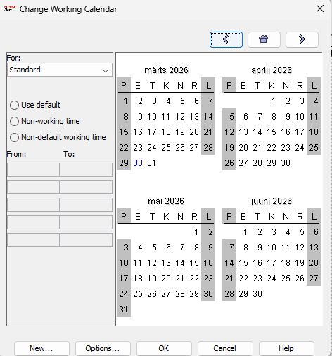
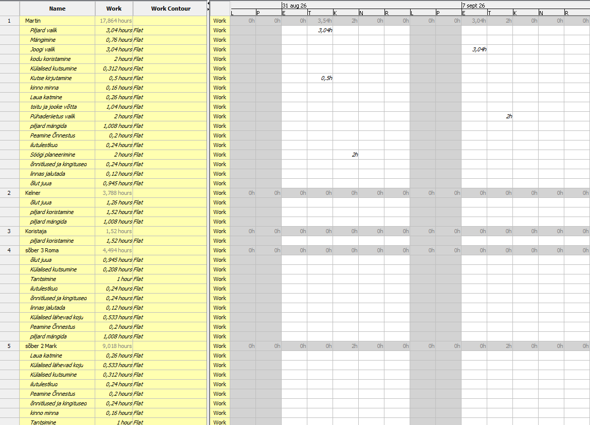

# 📅 KalenderProject ProjectLibre

## 📑 Sisukord
- [📌 Projekti kirjeldus](#-projekti-kirjeldus)
- [🚀 Põhifunktsionaalsus](#-põhifunktsionaalsus)
- [🖼️ Ekraanipildid](#️-ekraanipildid)
- [🛠️ Kasutatud tehnoloogiad](#️-kasutatud-tehnoloogiad)
- [📂 Projekti struktuur](#-projekti-struktuur)
- [🔗 Lingid](#-lingid)
- [👨‍💻 Autor](#-autor)

---

## 📌 Projekti kirjeldus

KalenderProject on õppeotstarbeline veebiprojekt, mis kujutab endast juhendit ProjectLibre kasutamiseks.

Projekt aitab kasutajal samm-sammult aru saada:

- 📆 kalendrite loomisest  
- 📊 diagrammide kasutamisest  

Kõik juhised on vormistatud mugava veebilehena koos visuaalsete näidete ja ekraanipiltidega.

---

## 🚀 Põhifunktsionaalsus

Projekt sisaldab mitut lehekülge:

### 📆 Kalender (index.html)
- Uue kalendri loomine  
- Tööpäevade ja tööaja seadistamine  
- Kalendri rakendamine projektile  

### 📊 Diagrammid (diagramm.html)
- Gantti-diagrammide kasutamine ja vaatamine
- Ressursidiagrammide vaatamine

---

## 🖼️ Ekraanipildid

### 📆 Kalendri loomine

### 📊 Diagrammid

---

## 🛠️ Kasutatud tehnoloogiad

Projekt on loodud kasutades põhilisi veebitehnoloogiaid:

- 🌐 HTML5 — lehekülgede struktuur  
- 🎨 CSS3 — kujundus ja animatsioonid  
- 📁 Lokaalsed pildid (kaust images/)  

---

## 📂 Projekti struktuur
KalenderProject/
│── index.html
│── diagramm.html
│── style.css
│── images/

---

## 🔗 Lingid
- GitHub: https://github.com/painkiller102k/KalenderProject  
- Microsoft Project: https://www.projectlibre.com/
- GitHub Pages: https://painkiller102k.github.io/KalenderProject/

---

## 👨‍💻 Autor
Martin Rossakov  
TARpv24  
