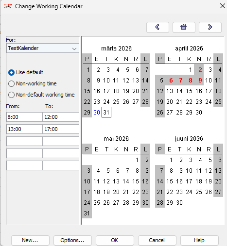
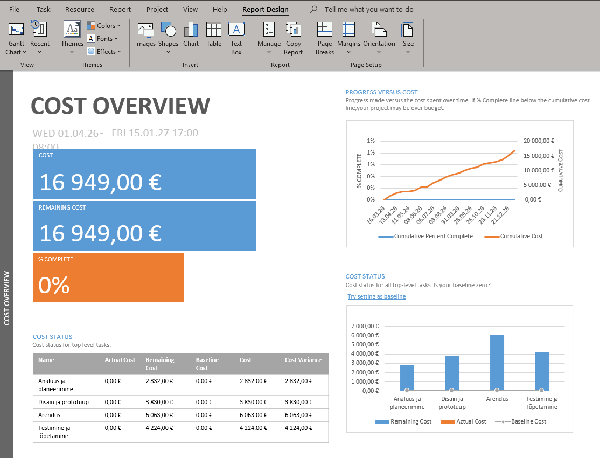

# 📅 KalenderProject ProjectLibre

## 📑 Sisukord
- [📌 Projekti kirjeldus](#-projekti-kirjeldus)
- [✅ Ülesannete nimekiri](#-ülesannete-nimekiri)
- [🚀 Põhifunktsionaalsus](#-põhifunktsionaalsus)
- [🖼️ Ekraanipildid](#️-ekraanipildid)
- [🛠️ Kasutatud tehnoloogiad](#️-kasutatud-tehnoloogiad)
- [📂 Projekti struktuur](#-projekti-struktuur)
- [💡 Märkused ja hoiatused](#-märkused-ja-hoiatused)
- [💻 Koodinäited](#-koodinäited)
- [🔗 Lingid](#-lingid)
- [📝 Footnotes](#-footnotes)

---

## 📌 Projekti kirjeldus

KalenderProject on õppeotstarbeline veebiprojekt, mis kujutab endast juhendit Microsoft Projecti kasutamiseks.

Projekt aitab kasutajal samm-sammult aru saada:

- 📆 kalendrite loomisest  
- 📊 diagrammide kasutamisest  

Kõik juhised on vormistatud mugava veebilehena koos visuaalsete näidete ja ekraanipiltidega.

---

## ✅ Ülesannete nimekiri

- [x] HTML lehed loodud
- [x] CSS disain valmis
- [x] Navigatsioon töötab
- [x] Ekraanipildid lisatud
- [ ] JavaScript funktsionaalsus
- [ ] Andmete salvestamine

---

## 🚀 Põhifunktsionaalsus

Projekt sisaldab mitut lehekülge:

### 📆 Kalender (index.html)
- Uue kalendri loomine  
- Tööpäevade ja tööaja seadistamine  
- Kalendri rakendamine projektile   

### 📊 Diagrammid (diagramm.html)
- GANTT-diagrammide vaatamine
- Ressursidiagrammide vaatamine[^1]

---

## 🖼️ Ekraanipildid

### 📆 Kalendri loomine


### 📊 Diagrammid


---

## 🛠️ Kasutatud tehnoloogiad

Projekt on loodud kasutades põhilisi veebitehnoloogiaid:

- 🌐 HTML5 — lehekülgede struktuur  
- 🎨 CSS3 — kujundus ja animatsioonid  
- 📁 Lokaalsed pildid (kaust images/)  

---

## 📂 Projekti struktuur

```text
KalenderProject/
├── 📄 index.html        # Kalenderi leht
├── 📄 diagramm.html     # Diagrammide leht
├── 📄 style.css         # Stiilid ja animatsioonid
└── 🖼️ images/          # Kõik ekraanipildid ja graafika
```

---

## 💡 Märkused ja hoiatused

>[!WARNING]
>Projekt töötab otse brauseris ega vaja serverit.

>[!NOTE]
>Soovitatav avada projekt Google Chrome või Edge brauseris.


>[!IMPORTANT]
>Mõned funktsioonid võivad vanemates brauserites mitte töötada.

---

## 💻 Koodinäited
Kuidas on sektsioonid ja astmed tehtud:

```html
    <section class="card">
        <h2>2. Gantt diagramm</h2>
        <p>Nüüd avaneb teie projekt koos Gantti diagrammiga, kus saate seadistada ülesannete ja allülesannete aega ning vaadata ajakava paremal ja päevade arvu</p>
        <div class="screenshot">
            
        </div>
    </section>

```
Kuidas on CSS animatsioonid tehtud:
```css
.nav a.active[href$="diagramm.html"] {
    background: linear-gradient(135deg, #00e6a8, #5affc2);
    color: #00291f;
    box-shadow: 0 6px 22px rgba(0, 230, 150, 0.5);
}

.card:nth-child(1) { animation-delay: 0.2s; }
.card:nth-child(2) { animation-delay: 0.4s; }
.card:nth-child(3) { animation-delay: 0.6s; }
.card:nth-child(4) { animation-delay: 0.8s; }
.card:nth-child(5) { animation-delay: 1s; }
.card:nth-child(6) { animation-delay: 1.2s; }

.card:hover {
    transform: translateY(-6px) scale(1.02);
    box-shadow: 0 0 25px rgba(0,255,170,0.25),
    0 20px 60px rgba(0,0,0,0.6);
}
```
## 🔗 Lingid
- [GitHub](https://github.com/painkiller102k/KalenderProject)
- [Microsoft Project](www.projectlibre.com/))[^2]
- [GitHub Pages](https://painkiller102k.github.io/KalenderProject/)

---


## 📝 Footnotes 
[^1]: Ressursidiagramm näitab töötajate ja materiaalsete ressursside kulutatud aega ja summasid.  
[^2]: ProjectLibre ametlik veebileht.
    
